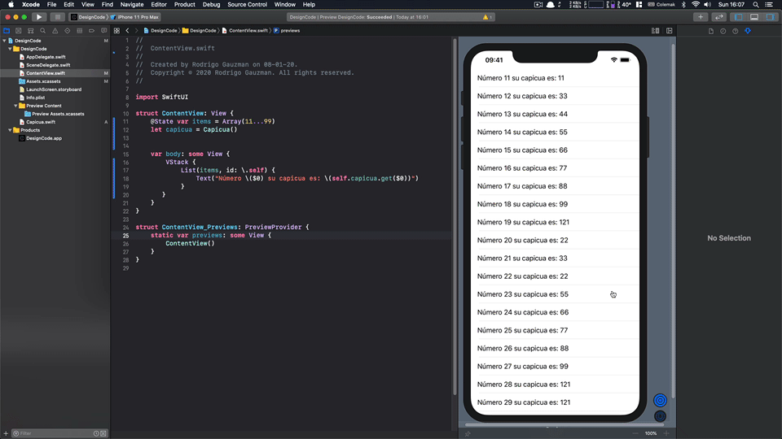

# Desafío Capicuas

https://www.programando.org/blog/2020/01/19/desafio-capicuas.html

* Swift 5
* SwiftUI

# Requerimientos
* Xcode 11.3
* MacOS catalina

# Comentarios

Una versión inutil solo para probar algo con SwiftUI

